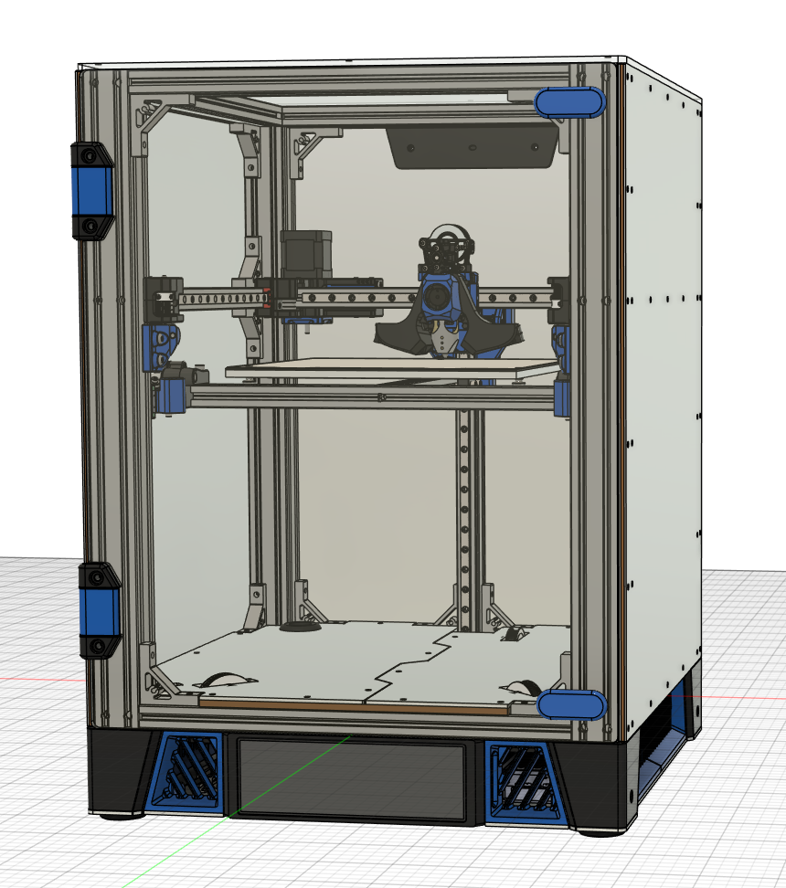

# Sapphire

Sapphire is a 250x250x230 CoreXY printer primarily featuring components from other projects:

* [Monolith gantry](https://github.com/CloakedWayne/Monolith_Gantry_V2-VT)
* [Archetype toolhead](https://github.com/Armchair-Heavy-Industries/Archetype)
* [Annex Engineering K3 Z system](https://github.com/Annex-Engineering/Gasherbrum-K3)
* 4040/2020 frame members
* Aluminum structural panels
* Slide out electronics bay
* Dual PSUs for mixed 24V and 48V components
* Dual SSRs for optional chamber heating
* [7.9" Waveshare DSI display](https://www.waveshare.com/7.9inch-dsi-lcd.htm)

## CAD

* CAD drawings for original design elements are included in [CAD/Base/Base.zip](CAD/Base/Sapphire.zip).
* Monolith and Archetype components can be found in their respective repositories.
* Modified version of K3Z can be found in [CAD/Z Components/Z Components.zip](<CAD/Z Components/Z Components.zip>), along with a copy of the Annex Engineering license agreement.

## STLs

No STLs are provided. Everything is available from CAD or external repositories.
