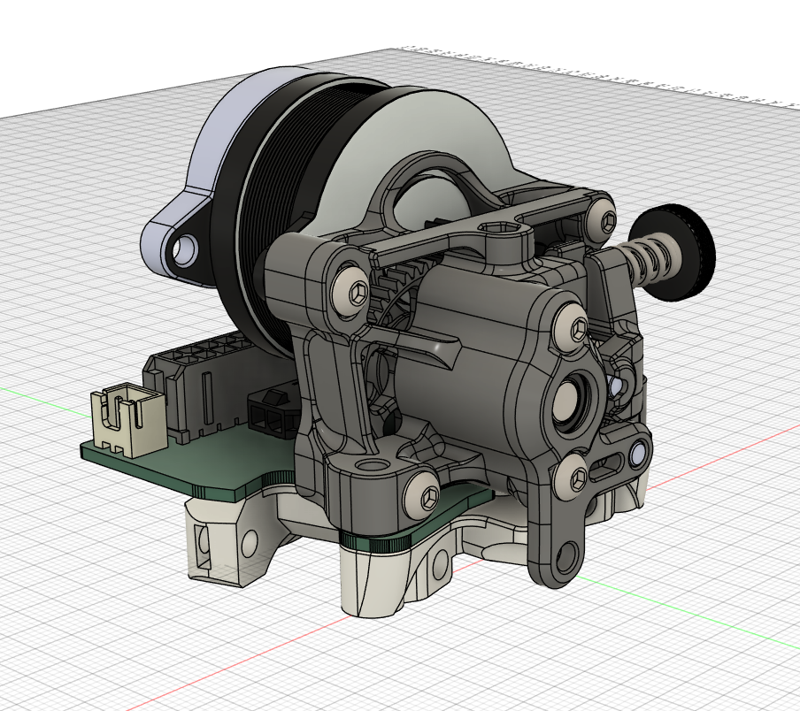

# Sapphire Toolboard

> [!WARNING]
> Archetype is in beta and is subject to change. Use this toolboard knowing that compatibility may break in the future.

  
  

These are the files used to produce and mount the toolhead PCB used in Sapphire.

## Production requirements

* 1.6mm thick
* 2 layers
* 1oz minimum (2oz preferred)

## Mounting

The toolboard is clamped between the Sherpa Mini and extruder block, as shown here:

## STLs

* K_Face.stl: An altered K-Face for the Sherpa Mini is necessary due to the thickness of the PCB.
* Strain_Relief.stl: Mounted to the back of the stepper motor to provide strain relief.

## Harness and distribution board

Pinout and harness compatible with [Xol PCB](https://github.com/ruiqimao/VoronStuff/tree/main/Xol_PCB).
